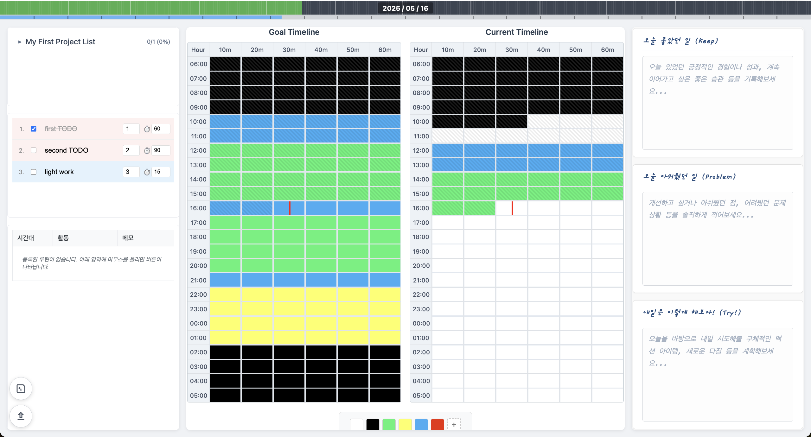

# A. 소개

시간 가계부

# B. Design Decisions
## a. meta 
1. 측정하지 않으면 개선할 수 없다 by 피터 드러커
2. essential component to any system: feedback loop
    - 복기를 보고 self-realize하고 self-feedback으로 조금씩 매일을 iterative하게 개선해 나가는 것 
2. goal: maximize self-awareness
    - 행동변화에 미치는 요소 중, 자신의 행동에 self-aware한 것, 자기 관찰, self-monitoring 만으로도 행동변화에 큰 영향을 미친다는 [뇌과학 연구](https://youtu.be/lBmRZrzbXqo?t=339)가 있다.
    - [많은 자기계발 방법의 효과중에 대부분이 상당부분이 사실은 자기관찰의 효과라고 한다.](https://youtu.be/lBmRZrzbXqo?t=405)
    - 왼쪽엔 내가 실제로 보낸 시간, 오른쪽에는 내가 목표로 하는 스케쥴. 서로 비교하며 얼만큼 근접했는지 본다.
    - 왼쪽에 빨간 FIXME time block으로 해당 순간 왜 procrastination 했고 어떤 느낌이었는지 적는다. 자책 목적이 아닌 self-aware 목적으로.

## b. project 
1. spend lots of time thinking about what's really worth spending your energy on?
2. inverse to get what you want (divide and conquer)
3. build roadmap with level design in consideration
4. llm-thinking model can help a lot 

## c. TODOs
1. 아이젠 하워 매트릭스(중요도 순)으로 정렬
    - 0: 일상
    - 1: 중요하고 긴급한 것 
    - 2: 중요한데 긴급하지는 않은 것
    - 3: 안중요한데 긴급한 것 
2. 오래걸리는 일(30분 이상)은 빨간색, 금방 끝나는 일은 파란색 
    - timeblock이 큰 덩이에는 오래 걸리는 일을 끼워넣고, 작은 덩이(자투리 시간)에는 금방 끝나는 일을 끼워넣기 
## d. routine
1. 루틴은 매일 반복이 핵심
2. 매일 루틴을 하나씩 수집하기 

## e. timeline 
1. TODOs, routine을 timeblock에 큰/작은 덩이에 끼워넣기
2. goal과 실제 시간 쓴 것을 계속 비교하면서 self-aware 하기 

## f. retrospect
1. keep: 오늘 놓았던 일 적기
2. problem: 아쉬웠던 점 적기
3. try!: 내일은 이렇게 개선해볼까? 적기 
4. goal: increase self-awareness

## g. yearly / daily progress 
- 1년 기준 오늘이 대략 얼마정도 시간이 흘렀고, 얼마나 남았는지 대략적으로 보여준다.
- 1일 24산 기준 현재 시간이 대략 얼마정도 시간이 흘렀고, 얼마나 남았는지 대략적으로 보여준다.
